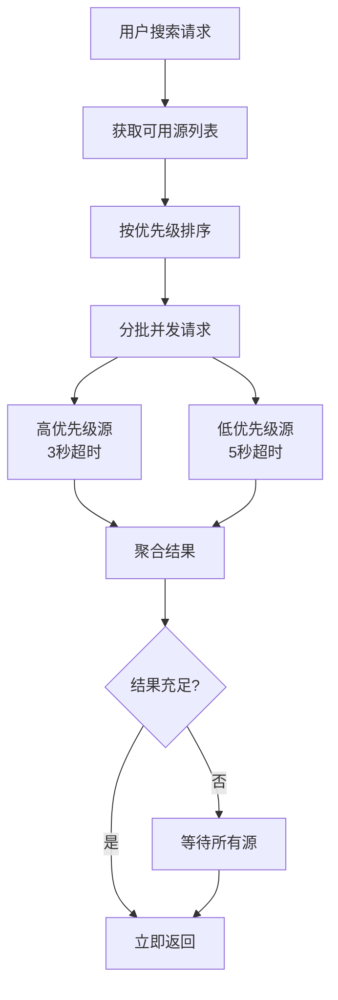
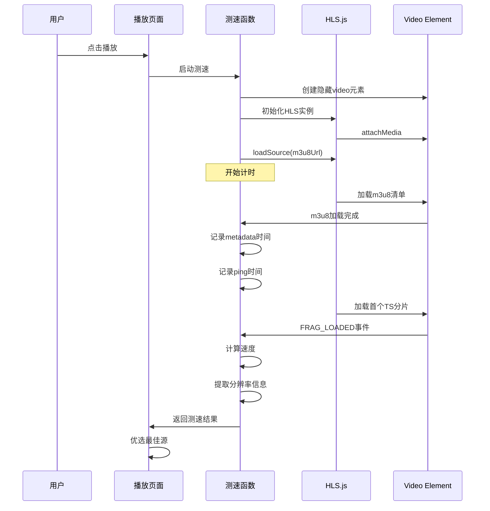
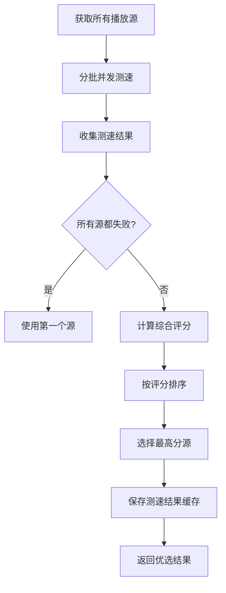

# MoonTV 项目深度分析文档

## 📋 项目概述

**MoonTV** 是一个基于 Next.js 14 构建的现代化影视聚合播放器，专注于提供流畅的多源视频搜索、聚合和在线播放体验。项目采用 TypeScript + Tailwind CSS 技术栈，支持多平台部署（Vercel、Cloudflare Pages、Docker）。

### 核心特性

- 🔍 **多源聚合搜索**：同时搜索数十个影视资源站点
- ⚡ **智能资源测速**：自动检测播放源速度并优选最佳线路
- 📄 **丰富详情页**：支持剧集列表、演员、年份、简介等完整信息
- ▶️ **流畅在线播放**：集成 HLS.js & ArtPlayer 播放器
- ❤️ **收藏 + 继续观看**：支持 Redis/D1/Upstash 存储，多端同步

---

## 🏗️ 技术架构

### 前端框架

```typescript
Next.js 14 (App Router)
├── TypeScript 4.x
├── Tailwind CSS 3
├── React 18.2
└── 响应式布局（桌面 + 移动端）
```

### 核心依赖

- **播放器**: ArtPlayer 5.2.3 + HLS.js 1.6.6
- **状态管理**: React Hooks + Context API
- **存储**: localStorage / Redis / Cloudflare D1 / Upstash
- **UI 组件**: Headless UI, Heroicons, Lucide React

### 部署方案

| 平台             | 存储支持               | Edge Runtime |
| ---------------- | ---------------------- | ------------ |
| Vercel           | localStorage / Upstash | ✅           |
| Cloudflare Pages | localStorage / D1      | ✅           |
| Docker           | localStorage / Redis   | ❌           |

---

## 🔍 资源搜索系统分析

### 1. 多源聚合架构

项目采用**分优先级并发搜索**的策略，同时请求多个影视资源站点，快速聚合搜索结果。

#### 核心实现：`src/app/api/search/route.ts`

```typescript
// 源优先级配置 - 响应快的源优先
const SOURCE_PRIORITY = {
  bfzy: 1, // 暴风资源 - 通常较快
  tyyszy: 2, // 天涯资源 - 稳定
  zy360: 3, // 360资源 - 较快
  wolong: 4, // 卧龙资源 - 中等
  jisu: 5, // 极速资源 - 较快
  dbzy: 6, // 豆瓣资源 - 中等
} as const;
```

#### 搜索流程



#### 关键技术点

**1. 分批请求策略**

```typescript
// 前6个高优先级源，快速返回
const highPrioritySites = sortedSites.slice(0, 6);
const lowPrioritySites = sortedSites.slice(6);

// 第一批：3秒超时
const highPriorityPromises = highPrioritySites.map((site) =>
  searchFromApiWithTimeout(site, query, 3000)
);

// 第二批：5秒超时
const lowPriorityPromises decodingSites.map((site) =>
  searchFromApiWithTimeout(site, query, 5000)
);
```

**2. 提前返回机制**

```typescript
// 如果高优先级源已有足够结果（≥10个），立即返回
if (initialResults.length >= 10) {
  // 后台继续等待其他源（用于缓存优化）
  lowPriorityResultsPromise.then((lowResults) => {
    // 后台处理，不阻塞用户
  });
  allResults = initialResults;
}
```

**3. 错误容错**

- 每个源请求独立，一个失败不影响其他源
- 使用 `Promise.allSettled` 确保所有请求都能完成
- 搜索失败返回空数组，不阻塞整体流程

### 2. 资源站配置

#### 配置文件：`config.json`

```json
{
  "cache_time": 7200,
  "api_site": {
    "dyttzy": {
      "api": "http://caiji.dyttzyapi.com/api.php/provide/vod",
      "name": "电影天堂资源",
      "detail": "http://caiji.dyttzyapi.com"
    }
    // ... 更多站点
  }
}
```

#### 支持的 API 格式

项目兼容**苹果 CMS V10 API 格式**：

```typescript
// 搜索接口
GET {api}/?ac=videolist&wd={query}
GET {api}/?ac=videolist&wd={query}&pg={page}

// 详情接口
GET {api}/?ac=videolist&ids={id}
```

**响应格式**：

```json
{
  "code": 1,
  "msg": "数据列表",
  "page": 1,
  "pagecount": 5,
  "limit": 20,
  "total": 100,
  "list": [
    {
      "vod_id": "12345",
      "vod_name": "影片标题",
      "vod_pic": "封面URL",
      "vod_play_url": "播放链接",
      "vod_class": "类型",
      "vod_year": "2024",
      "vod_content": "简介"
    }
  ]
}
```

### 3. 搜索结果处理

#### 核心函数：`src/lib/downstream.ts::searchFromApi`

**多页搜索支持**：

```typescript
// 支持搜索多页结果（默认最多5页）
const MAX_SEARCH_PAGES: number = config.SiteConfig.SearchDownstreamMaxPage;

// 获取总页数
const pageCount = data.pagecount || 1;
const pagesToFetch = Math.min(pageCount - 1, MAX_SEARCH_PAGES - 1);

// 并发请求多页结果
for (let page = 2; page <= pagesToFetch + 1; page++) {
  const pageUrl =
    apiBaseUrl +
    API_CONFIG.search.pagePath
      .replace('{query}', encodeURIComponent(query))
      .replace('{page}', page.toString());
  // 并发请求...
}
```

**m3u8 链接提取**：

```typescript
// 使用正则表达式提取m3u8链接
const m3u8Regex = /\$(https?:\/\/[^"'\s]+?\.m3u8)/g;

// 使用 $$$ 分割多个播放源
const vod_play_url_array = item.vod_play_url.split('$$$');

// 对每个分片做匹配，取匹配到最多的作为结果
vod_play_url_array.forEach((url: string) => {
  const matches = url.match(m3u8Regex) || [];
  if (matches.length > episodes.length) {
    episodes = matches;
  }
});
```

**内容过滤**：

```typescript
// 支持色情内容过滤
if (!config.SiteConfig.DisableYellowFilter) {
  flattenedResults = flattenedResults.filter((result) => {
    const typeName = result.type_name || '';
    return !yellowWords.some((word: string) => typeName.includes(word));
  });
}
```

---

## ⚡ 资源测速系统分析

### 1. 智能测速机制

项目实现了**客户端实时测速**，通过实际加载视频片段来评估播放源的网络性能和质量。

#### 核心实现：`src/lib/utils.ts::getVideoResolutionFromM3u8`

```typescript
export async function getVideoResolutionFromM3u8(m3u8Url: string): Promise<{
  quality: string; // 分辨率：如 720p、1080p、4K
  loadSpeed: string; // 加载速度：KB/s 或 MB/s
  pingTime: number; // 网络延迟（毫秒）
}>;
```

#### 测速流程



#### 关键技术点

**1. 延迟测量**

```typescript
// 使用 m3u8 URL 而不是具体的 ts 文件
const pingStart = performance.now();
fetch(m3u8Url, { method: 'HEAD', mode: 'no-cors' })
  .then(() => {
    pingTime = performance.now() - pingStart;
  })
  .catch(() => {
    pingTime = performance.now() - pingStart;
  });
```

**2. 加载速度计算**

```typescript
// 监听首个分片加载完成，计算速度
hls.on(Hls.Events.FRAG_LOADED, (event: any, data: any) => {
  if (fragmentStartTime > 0 && data && data.payload && !hasSpeedCalculated) {
    const loadTime = performance.now() - fragmentStartTime;
    const size = data.payload.byteLength || 0;

    if (loadTime > 0 && size > 0) {
      const speedKBps = size / 1024 / (loadTime / 1000);

      // 转换为合适的单位
      if (speedKBps >= 1024) {
        actualLoadSpeed = `${(speedKBps / 1024).toFixed(1)} MB/s`;
      } else {
        actualLoadSpeed = `${speedKBps.toFixed(1)} KB/s`;
      }
      hasSpeedCalculated = true;
    }
  }
});
```

**3. 超时处理**

```typescript
const timeout = setTimeout(() => {
  hls.destroy();
  video.remove();
  reject(new Error('Timeout loading video metadata'));
}, 4000); // 4秒超时
```

**4. 分辨率提取**

```typescript
// 从视频元数据中提取分辨率
video.onloadedmetadata = () => {
  const videoWidth = video.videoWidth;
  const videoHeight = video.videoHeight;

  // 根据分辨率判断质量等级
  if (videoWidth >= 3840) quality = '4K';
  else if (videoWidth >= 1920) quality = '1080p';
  else if (videoWidth >= 1280) quality = '720p';
  // ...
};
```

### 2. 资源优选算法

#### 核心函数：`src/app/play/page.tsx::preferBestSource`

项目实现了**综合评分算法**，综合考虑分辨率、加载速度和网络延迟。

#### 评分权重

```
总分 = 分辨率评分 × 40% + 加载速度评分 × 40% + 延迟评分 × 20%
```

**1. 分辨率评分（40% 权重）**

```typescript
const qualityScore = (() => {
  switch (testResult.quality) {
    case '4K':
      return 100;
    case '2K':
      return 85;
    case '1080p':
      return 75;
    case '720p':
      return 60;
    case '480p':
      return 40;
    case 'SD':
      return 20;
    default:
      return 0;
  }
})();
score += qualityScore * 0.4;
```

**2. 加载速度评分（40% 权重）**

```typescript
// 基于最大速度线性映射，最高100分
const speedKBps = unit === 'MB/s' ? value * 1024 : value;
const speedRatio = speedKBps / maxSpeed;
return Math.min(100, Math.max(0, speedRatio * 100));
```

**3. 网络延迟评分（20% 权重）**

```typescript
// 线性映射：最低延迟=100分，最高延迟=0分
const pingRatio = (maxPing - ping) / (maxPing - minPing);
return Math.min(100, Math.max(0, pingRatio * 100));
```

#### 批量测速优化

```typescript
// 将播放源均分为两批，并发测速各批，避免一次性过多请求
const batchSize = Math.ceil(sources.length / 2);

for (let start = 0; start < sources.length; start += batchSize) {
  const batchSources = sources.slice(start, start + batchSize);
  const batchResults = await Promise.all(
    batchSources.map(async (source) => {
      // 测速逻辑...
    })
  );
  allResults.push(...batchResults);
}
```

#### 优选流程



---

## 🎬 资源聚合系统分析

### 1. 搜索结果聚合

#### 聚合策略

项目采用**去重 + 过滤 + 排序**的多层聚合机制：

```typescript
// 1. 所有源结果扁平化
let flattenedResults = allResults;

// 2. 内容过滤（如果启用）
if (!config.SiteConfig.DisableYellowFilter) {
  flattenedResults = flattenedResults.filter((result) => {
    const typeName = result.type_name || '';
    return !yellowWords.some((word: string) => typeName.includes(word));
  });
}

// 3. 返回聚合结果（带缓存）
return NextResponse.json(
  { results: flattenedResults },
  {
    headers: {
      'Cache-Control': `public, max-age=${cacheTime}, s-maxage=${cacheTime}`,
    },
  }
);
```

#### 缓存机制

```typescript
// 接口缓存时间：默认7200秒（2小时）
const cacheTime = await getCacheTime(); // 从配置读取

// 多层级缓存头
headers: {
  'Cache-Control': `public, max-age=${cacheTime}, s-maxage=${cacheTime}`,
  'CDN-Cache-Control': `public, s-maxage=${cacheTime}`,
  'Vercel-CDN-Cache-Control': `public, s-maxage=${cacheTime}`,
}
```

### 2. 详情数据聚合

#### 详情获取流程：`src/app/api/detail/route.ts`

```typescript
export async function GET(request: Request) {
  const id = searchParams.get('id');
  const sourceCode = searchParams.get('source');

  // 1. 验证参数
  if (!/^[\w-]+$/.test(id)) {
    return NextResponse.json({ error: '无效的视频ID格式' }, { status: 400 });
  }

  // 2. 查找对应的API站点
  const apiSite = apiSites.find((site) => site.key === sourceCode);

  // 3. 获取详情
  const result = await getDetailFromApi(apiSite, id);

  // 4. 返回带缓存的结果
  return NextResponse.json(result, { headers: { ... } });
}
```

#### 特殊源处理：`src/lib/downstream.ts::handleSpecialSourceDetail`

对于无法通过 API 获取剧集详情的站点，项目通过**HTML 爬取**获取：

```typescript
async function handleSpecialSourceDetail(
  id: string,
  apiSite: ApiSite
): Promise<SearchResult> {
  const detailUrl = `${apiSite.detail}/index.php/vod/detail/id/${id}.html`;

  // 请求HTML页面
  const response = await fetch(detailUrl);
  const html = await response.text();

  // 使用正则提取m3u8链接
  let matches: string[] = [];
  if (apiSite.key === 'ffzy') {
    const ffzyPattern =
      /\$(https?:\/\/[^"'\s]+?\/\d{8}\/\d+_[a-f0-9]+\/index\.m3u8)/g;
    matches = html.match(ffzyPattern) || [];
  }

  // 提取标题、描述、封面等
  const titleMatch = html.match(/<h1[^>]*>([^<]+)<\/h1>/);
  const descMatch = html.match(/<div[^>]*class=["']sketch["'][^>]*>([\s\S]*?)<\/div>/);
  const coverMatch = html.match(/(https?:\/\/[^"'\s]+?\.jpg)/g);

  return {
    id, title, poster, episodes, source, source_name, ...
  };
}
```

### 3. 播放源管理

#### 多源切换

项目支持在播放过程中**动态切换播放源**：

```typescript
const handleSourceChange = async (
  newSource: string,
  newId: string,
  newTitle: string
) => {
  // 1. 显示加载状态
  setVideoLoadingStage('sourceChanging');
  setIsVideoLoading(true);

  // 2. 保存当前播放进度
  const currentPlayTime = artPlayerRef.current?.currentTime || 0;

  // 3. 清除前一个历史记录
  await deletePlayRecord(currentSourceRef.current, currentIdRef.current);

  // 4. 获取新源详情
  const newDetail = availableSources.find(
    (source) => source.source === newSource && source.id === newId
  );

  // 5. 跳转到当前集数
  let targetIndex = currentEpisodeIndex;
  if (targetIndex >= newDetail.episodes.length) {
    targetIndex = 0;
  }

  // 6. 更新状态并恢复播放
  setDetail(newDetail);
  setCurrentEpisodeIndex(targetIndex);
};
```

#### 可用源列表

播放页面会提前获取所有可用源：

```typescript
// 进入页面时直接获取全部源信息
useEffect(() => {
  const fetchSourcesData = async (query: string): Promise<SearchResult[]> => {
    const response = await fetch(
      `/api/search?q=${encodeURIComponent(query.trim())}`
    );
    const data = await response.json();

    // 处理搜索结果，根据规则过滤
    const results = data.results.filter(
      (result: SearchResult) =>
        result.title.replaceAll(' ', '').toLowerCase() ===
          videoTitleRef.current.replaceAll(' ', '').toLowerCase() &&
        (videoYearRef.current
          ? result.year.toLowerCase() === videoYearRef.current.toLowerCase()
          : true) &&
        (searchType
          ? (searchType === 'tv' && result.episodes.length > 1) ||
            (searchType === 'movie' && result.episodes.length === 1)
          : true)
    );
    return results;
  };
}, []);
```

---

## 📊 性能优化策略

### 1. 搜索性能

| 优化项       | 实现方式                     | 效果                |
| ------------ | ---------------------------- | ------------------- |
| **分批请求** | 高优先级 6 个源先返回        | 平均响应时间 < 3 秒 |
| **超时控制** | 高优先级 3 秒，低优先级 5 秒 | 避免长时间等待      |
| **提前返回** | 结果 ≥ 10 个立即返回         | 快速响应用户        |
| **缓存**     | CDN + 边缘缓存               | 重复搜索 < 100ms    |
| **错误容错** | Promise.allSettled           | 部分失败不影响整体  |

### 2. 测速性能

| 优化项       | 实现方式             | 效果               |
| ------------ | -------------------- | ------------------ |
| **批量测速** | 分两批并发测速       | 总测速时间减少 50% |
| **快速失败** | 4 秒超时机制         | 避免卡死           |
| **缓存结果** | precomputedVideoInfo | 避免重复测速       |
| **只测首集** | 使用第一集 URL       | 减少测速时间       |
| **异步处理** | Promise.all 并发     | 并行测速多个源     |

### 3. 播放性能

| 优化项        | 实现方式             | 效果           |
| ------------- | -------------------- | -------------- |
| **HLS 缓冲**  | maxBufferLength: 30s | 减少内存占用   |
| **低延迟**    | lowLatencyMode: true | 降低播放延迟   |
| **WebWorker** | enableWorker: true   | 降低主线程压力 |
| **自动优选**  | 综合评分算法         | 最佳播放体验   |

---

## 🔧 配置系统

### 环境变量

| 变量                                | 说明         | 默认值       |
| ----------------------------------- | ------------ | ------------ |
| `NEXT_PUBLIC_STORAGE_TYPE`          | 存储方式     | localstorage |
| `NEXT_PUBLIC_SEARCH_MAX_PAGE`       | 搜索最大页数 | 5            |
| `NEXT_PUBLIC_IMAGE_PROXY`           | 图片代理     | 空           |
| `NEXT_PUBLIC_DOUBAN_PROXY`          | 豆瓣代理     | 空           |
| `NEXT_PUBLIC_DISABLE_YELLOW_FILTER` | 关闭色情过滤 | false        |
| `PASSWORD`                          | 站点密码     | 空           |
| `USERNAME`                          | 管理员账号   | 空           |

### 运行时配置

项目支持**动态配置管理**：

1. **config.json**：静态配置（源站点列表、自定义分类）
2. **AdminConfig**：运行时配置（通过管理页面修改）
3. **数据库存储**：配置持久化（Redis/D1）

---

## 🎯 核心优势

### 1. 搜索优势

✅ **多源并发**：同时搜索 20+个资源站点  
✅ **智能排序**：优先返回快速站点  
✅ **错误容错**：部分失败不影响整体  
✅ **缓存优化**：CDN 边缘缓存加速

### 2. 测速优势

✅ **实时测速**：实际加载视频片段  
✅ **综合评分**：质量+速度+延迟  
✅ **快速优选**：4 秒内完成测速  
✅ **智能缓存**：避免重复测速

### 3. 播放优势

✅ **流畅播放**：HLS.js + ArtPlayer  
✅ **多源切换**：播放中可切换源  
✅ **自动优选**：智能选择最佳源  
✅ **播放记录**：多端同步进度

---

## 🔮 扩展建议

### 1. 搜索优化

- [ ] 添加搜索建议（自动完成）
- [ ] 搜索结果去重（标题+年份匹配）
- [ ] 支持高级筛选（类型、年份、地区）
- [ ] 添加搜索历史记录

### 2. 测速优化

- [ ] 添加测速结果持久化
- [ ] 基于地理位置优选源
- [ ] 支持用户自定义优选权重
- [ ] 添加测速失败自动重试

### 3. 聚合优化

- [ ] 统一播放源格式（标准化）
- [ ] 合并相同视频的多个源
- [ ] 添加源可用性监控
- [ ] 支持自定义聚合规则

### 4. 性能优化

- [ ] 添加 Service Worker 缓存
- [ ] 使用 WebAssembly 加速解析
- [ ] 添加预加载机制
- [ ] 优化大列表渲染（虚拟滚动）

---

## 📝 总结

MoonTV 项目在资源搜索、聚合和测速方面展现了**清晰的架构设计**和**优秀的工程实践**：

1. **搜索系统**：分优先级并发、智能容错、快速响应
2. **测速系统**：实时检测、综合评分、智能优选
3. **聚合系统**：多源整合、去重过滤、缓存加速

项目代码质量高，架构清晰，易于扩展和维护。通过合理的优化策略，确保了良好的用户体验和系统性能。

---

**文档版本**: v1.0  
**最后更新**: 2025 年 1 月  
**项目地址**: https://github.com/senshinya/moontv
